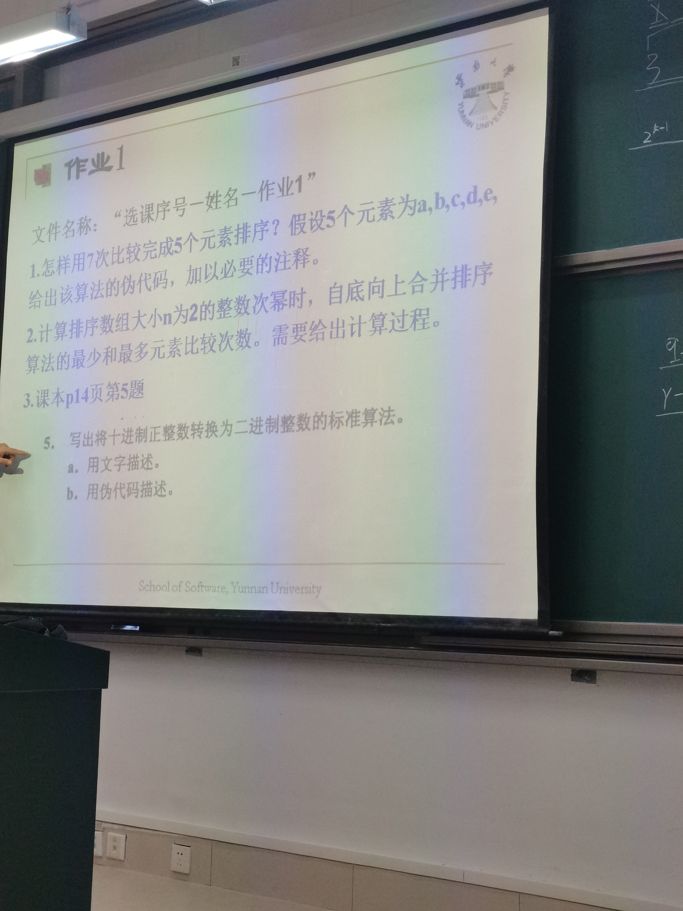

# 易错总结

## 二分查找类

初始化right = numsSize - 1

最好用闭区间，闭处加减1，不用判断numsSize是否为0

或者用一边闭一边开，开处不加减1，这需要单独加上numsSize != 0 的输入合法性判断

出现重复元素时比较麻烦

做题顺序:

- 704
- 35
- 34,对基本二分查找法进行了修改，还是以闭区间优先，但是将left <= right 循环条件拆解为while{left < right} 和 if{nums[left] == target}，这与leetcode官网的方法是一致的，应用：能用于字符串连续重复字段查找
- 367
- 69，更贴近35，因为找不到准确值
- 27

# 算法

## 算法效率分析的基本概念

- 问题规模 n 的确定：
  - 当输出为单个数值时，按照输入数值的位数来确定 n
  - 矩阵一般以边数为 n

> 两个 n x n 矩阵的乘法运算次数为 n^3

- 基本操作：
  - 比较运算中：查找和比较
  - 运算：加减乘除，当加减和乘除同时进行时，加减可以忽略

- 分析三种性能：
  - 最坏情况：最坏情况下的运行时间，执行时间的上界
  - 最好情况：最好情况下的运行时间，执行时间的下界
  - 平均情况：所有情况下的运行时间的期望值

常见算法运行时间增长阶从低到高有：
logn, n, nlogn, n^2, n^3, 2^n, n!

## 算法的渐进效率分析

一个算法的运行时间T(n) = O(g(n))，是指当输入n的大小等于或者超过某个阈值n0时，T(n)的增长率不会超过g(n)的增长率

## 排序算法

优先选择快速排序

nlogn 级别的排序算法：快速排序，归并排序，堆排序

归并排序

元素排序的比较次数最少为

元素比较次数最多为

执行该算法的元素复制次数为2nlog2n

## 作业

任何5个元素，如何用最多7次比较找出最大值

