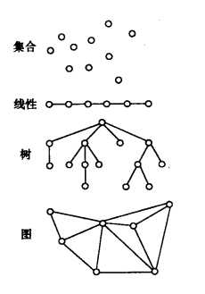
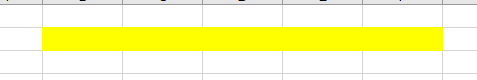
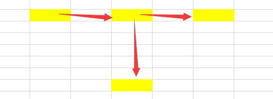
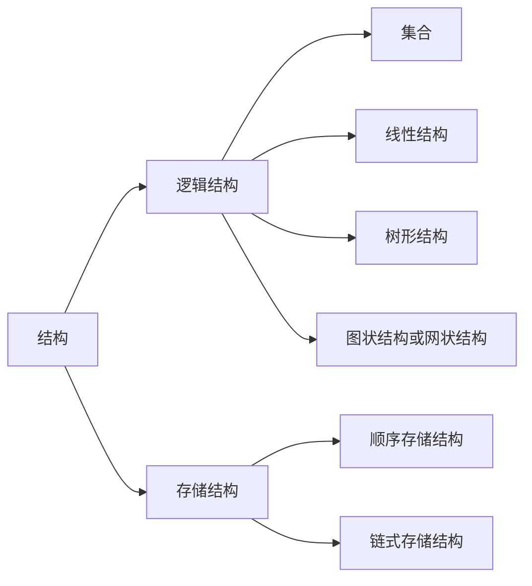
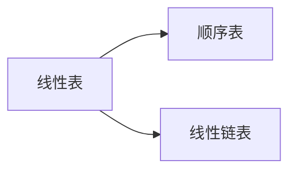

# 数据结构

## 术语

**逻辑结构**描述数据元素间的关系



**存储结构**：数据结构在计算机中的表示包括数据元素的表示和关系的表示

**顺序存储结构**地址连续



**链式存储结构**地址不连续





实际使用中要考虑逻辑结构也要考虑存储结构

## 线性结构

**线性结构**（指的是逻辑结构）

特点：

- 存在唯一一个被称为“第一个”的数据元素

*数据元素：数据的基本单位，一个整体*

- 存在唯一一个被称为“最后一个”的数据元素

- 除了第一个元素，集合中的每个元素均只有一个前趋
- 除了最后一个之外，集合中每个数据元素只有一个后继

**线性表**一种具有线性结构的数据结构，线性表的实现方式：顺序存储结构的实现，链式存储结构的实现。



### 顺序表

### 线性链表/单链表

**头指针**单链表由表头唯一确定，因此单链表可以用头指针的名字来命名，此**头指针**一般指向头节点

类比顺序表：

```c
int a[10];
a[1]a[2]
*(a+1)和a[1]
int function(int * a ){}
function(a);
```

**结点**链表中的数据元素，包括两个域：数据域和指针域

| 数据域 | 指针域 |
| ------ | ------ |
| data   | next   |

```C
typedef struct LNode{
    ElemType data;
    struct LNode * next;
}LNode,* LinkList;
//用LNode类型表示结点，LinkList类型表示头指针/表头
```

**头结点**指针直接指向的一个结点将数据域用来存储其他信息（如哨兵，链长）

**相比于顺序存储结构，单链表是非随机存取的存储结构**


头插法建立链表和遍历展示链表的函数实现

```C
# include<stdio.h>
# include<stdlib.h>

typedef int ElemType;
//用LNode类型表示结点，LinkList类型表示头指针/表头
typedef struct LNode{
    ElemType data;
    struct LNode * next;
}LNode,* LinkList;

//使用头插法以L为头指针建立一个链表，除开头结点有n个结点
int CreatListFromHead(LinkList & L , int n){
    L = (LNode * )malloc(sizeof(LNode));//给L分配头结点的空间
    L->next = NULL;
    for (int i = 0; i < n; i++)
    {
        LNode * ptToNewNode = (LNode *)malloc(sizeof(LNode));
        scanf("%d",&ptToNewNode->data);
        ptToNewNode->next = L->next;
        L->next = ptToNewNode;
    }
    return 1;
}
int DisplayList(LinkList L){
    if(!L->next){ // L->next == NULL
        printf("空链");
        return 0;
    }else{
        LNode * current = L->next;//current指向正在遍历的当前结点
        while(current){
            printf("%d ",current->data);
            current = current->next; //遍历必须的操作
        }
        printf("\n");
        return 1;
    }
}

int main(){
    LinkList head;
    CreatListFromHead(head,5);
    DisplayList(head);
    return 0;
}
```

